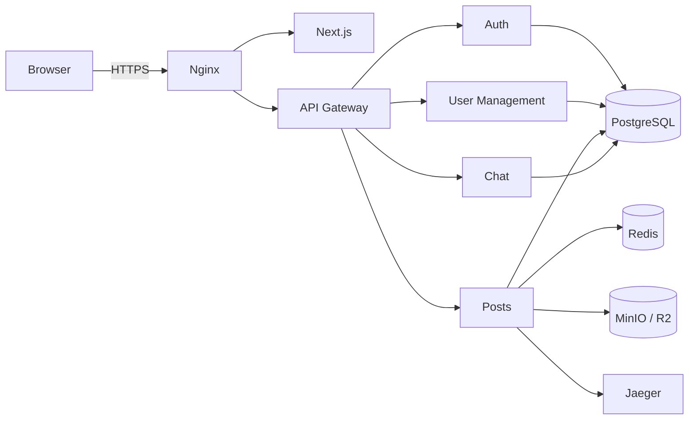
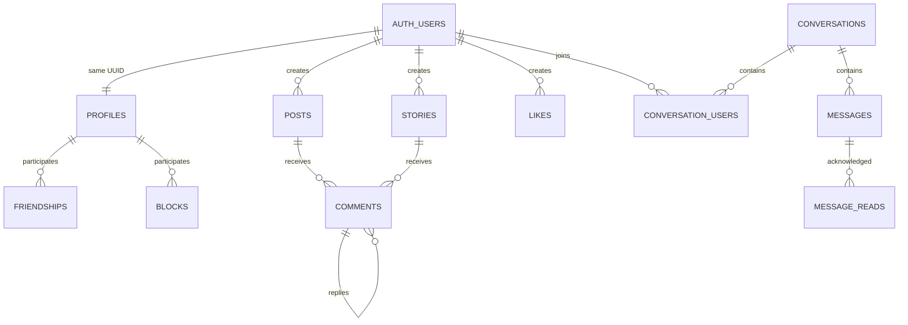

# Vellum

> Created as part of the 42 curriculum by `pdrago`, `dherszen`, `rafaelro`, `gamoraes`, and `fnascime`.
>
> Subject version: 19.0

## Description

**Vellum** is a full-stack social network built for the 42 `ft_transcendence` project. It provides secure account management, social publishing, user relationships, and real-time direct and group communication.

The application follows a microservice architecture behind nginx and an API gateway. Authentication, profiles, posts, and chat are independently maintained services sharing PostgreSQL through isolated schemas.

### Key Features

- Local registration, JWT login, Google OAuth 2.0, and optional TOTP 2FA.
- Profiles, avatars, friend requests, friendships, and blocking.
- Posts, temporary stories, media, threaded comments, and likes.
- Direct and group conversations with messages, typing indicators, read receipts, presence, and last-seen status.
- HTTPS-only public access, Redis caching, S3-compatible storage, and distributed tracing.

## Team Information

| Member | Role(s) | Responsibilities |
|---|---|---|
| `pdrago` | Tech Lead, Developer | Led architectural decisions and implemented the authentication service and API gateway. |
| `dherszen` | Project Manager, Developer | Organized the team, implemented the user-management service, and contributed to the authentication service. |
| `rafaelro` | Developer | Implemented the chat service and its real-time communication features. |
| `gamoraes` | Developer | Implemented the posts service, including publishing, media, comments, likes, caching, and observability. |
| `fnascime` | Product Owner, Developer | Directed product decisions and implemented the frontend and reusable design system. |

## Project Management

### Organization

The project was divided primarily by service and feature area. GitHub Issues were created and assigned according to each member's preferences and technical experience. The microservice boundaries allowed the team to work in parallel, while shared contracts, Git integration, and team discussions were used to coordinate cross-service behavior.

### Tools

- Git and GitHub for version control and integration.
- GitHub Issues for task tracking and assignment.

### Communication

- WhatsApp for day-to-day coordination, decisions, and technical discussions.

## Technical Stack

| Area | Technologies | Rationale |
|---|---|---|
| Frontend | Next.js, React, TypeScript, next-intl | Typed component UI, routing, and internationalization. |
| Gateway | NestJS, Passport JWT, http-proxy-middleware | Central routing, JWT validation, and identity forwarding. |
| Authentication | NestJS, Passport, JWT, bcrypt, Google OAuth, TOTP | Stateless local/federated authentication with optional 2FA. |
| User management | NestJS, TypeORM | Structured profile and transactional social-graph logic. |
| Posts | Bun, Elysia, Drizzle ORM, Zod | Lightweight HTTP service with schema-derived validation. |
| Chat | Elixir, Phoenix, Channels, Presence | Fault-tolerant real-time messaging and presence. |
| Data | PostgreSQL 16, Redis 8, MinIO/R2 | Relational integrity, caching, and direct media storage. |
| Infrastructure | Docker Compose, nginx, OpenTelemetry, Jaeger | Reproducible HTTPS deployment and tracing. |

PostgreSQL was selected for ACID transactions, relational constraints, UUID support, and schema isolation between services.

### Architecture



Only nginx is host-facing. Services communicate on a private Docker network.

### Service Endpoints

Public traffic is restricted to the nginx reverse proxy:

| Endpoint | Address | Destination |
|---|---|---|
| Frontend | `https://localhost` | `frontend:3000` |
| API gateway | `https://localhost:8443` | `gateway:4000` |

The remaining services are available only on the `transcendence-internal` Docker network:

| Service | Internal address |
|---|---|
| Authentication | `http://auth-service:4001` |
| Chat | `http://chat-service:4002` |
| User management | `http://user-service:3002` |
| Posts | `http://posts-service:3333` |
| PostgreSQL | `database:5432` |
| Redis | `redis:6379` |
| MinIO API | `http://minio:9000` |
| MinIO console | `http://minio:9001` |
| Jaeger | `http://jaeger:16686` |

## Database Schema

The shared database uses the `auth`, `user_management`, `posts`, and `chat` schemas. UUID user identifiers cross service boundaries.



| Schema | Tables | Key fields and relationships |
|---|---|---|
| auth | users | UUID, username, email, password hash, OAuth identity, timestamps, username state, and 2FA fields. |
| user_management | profiles, friendships, blocks | Profile data; requester/addressee friendship state; blocker/blocked relationships. |
| posts | posts, stories, comments, likes | User-owned content; threaded replies; polymorphic likes; media metadata. |
| chat | conversations, conversation_users, messages, message_reads, user_statuses | Membership, roles, messages, read state, and last-seen state. |

<!-- Verify final field names and constraints against migrations if the schema changes. -->

## Features List

| Feature | Functionality | Contributor(s) |
|---|---|---|
| Authentication | Local accounts, password hashing, JWTs, Google OAuth, and TOTP 2FA. | `pdrago`, `dherszen` |
| Profiles | Profile details, username synchronization, avatars, and account data controls. | `dherszen`, `fnascime` |
| Social graph | Friend requests, friendships, blocking, and transactional privacy rules. | `dherszen`, `fnascime` |
| Publishing | Posts, stories, direct media uploads, comments, replies, and likes. | `gamoraes`, `fnascime` |
| Chat | Direct/group conversations, membership, history, and real-time messages. | `rafaelro`, `fnascime` |
| Real-time status | Typing, read receipts, presence, and last-seen state. | `rafaelro`, `fnascime` |
| Gateway/security | JWT validation, request routing, HTTPS, and network isolation. | `pdrago` |
| Frontend experience | Responsive interface, design system, PWA support, accessibility, multilingual content, and RTL layout. | `fnascime` |
| Platform services | Redis caching, object storage, tracing, PostgreSQL schemas, and container orchestration. | `pdrago`, `dherszen`, `rafaelro`, `gamoraes` |

## Modules

| Classification | Exact subject module | Points | Justification | Implementation | Contributor(s) |
|---|---|---:|---|---|---|
| Minor | Use a frontend framework | 1 | Provides a structured, maintainable client application. | Next.js and React provide routing, rendering, and component composition. | `fnascime` |
| Minor | Use a backend framework | 1 | Establishes consistent service structure and validation. | NestJS, Elysia, and Phoenix are used according to each service's requirements. | `pdrago`, `dherszen`, `rafaelro`, `gamoraes` |
| Major | Implement real-time features using WebSockets or similar technology | 2 | Enables immediate communication and status updates. | Phoenix Channels and Presence provide messages, typing events, read receipts, and online status. | `rafaelro`, `fnascime` |
| Major | Allow users to interact with other users | 2 | Supplies the core social-network experience. | Friendships, blocking, posts, comments, likes, direct messages, and group conversations connect users. | All members |
| Minor | Use an ORM for the database | 1 | Improves schema safety, migrations, and typed data access. | TypeORM, Drizzle ORM, and Ecto manage service-owned PostgreSQL schemas. | `pdrago`, `dherszen`, `rafaelro`, `gamoraes` |
| Minor | Progressive Web App with offline support and installability | 1 | Makes the web application installable and more resilient. | The frontend includes a web manifest, service worker, and installation prompt. | `fnascime` |
| Minor | Custom-made design system with reusable components | 1 | Keeps visual behavior consistent and maintainable. | Reusable components, icons, typography, color tokens, and Storybook stories form the design system. | `fnascime` |
| Major | Complete accessibility compliance (WCAG 2.1 AA) | 2 | Makes the application usable with keyboards, screen readers, and assistive technology. | Semantic markup, ARIA attributes, focus behavior, keyboard navigation, contrast, and responsive layouts were applied across the frontend. | `fnascime` |
| Minor | File upload and management system | 1 | Supports user avatars and social media content. | Avatar uploads and presigned MinIO/R2 media uploads validate, store, move, and serve files. | `dherszen`, `gamoraes`, `fnascime` |
| Minor | Support for multiple languages | 1 | Makes the interface available to a broader audience. | `next-intl` loads translated message catalogs and exposes language selection in the UI. | `fnascime` |
| Minor | Right-to-left language support | 1 | Correctly supports languages written from right to left. | Locale-aware document direction and dedicated RTL layout rules adapt the interface. | `fnascime` |
| Minor | Support for additional browsers | 1 | Improves availability across common browser environments. | Standards-based responsive UI, HTTPS, and browser-compatible APIs are used across the frontend. | `fnascime` |
| Major | Standard user management and authentication | 2 | Protects identity and account operations. | Registration, login, JWTs, password management, profiles, friendships, blocking, and avatars are implemented in dedicated services. | `pdrago`, `dherszen`, `fnascime` |
| Minor | Implement remote authentication with OAuth 2.0 | 1 | Offers a secure alternative to local credentials. | Google OAuth uses a server-side callback, short-lived handoff token, and application JWT exchange. | `pdrago`, `dherszen`, `fnascime` |
| Minor | Implement a complete 2FA system | 1 | Adds a second verification factor to account access. | TOTP enrollment, QR setup, activation, authentication, status, and deactivation flows are provided. | `pdrago`, `fnascime` |
| Major | Backend as microservices | 2 | Enables service ownership, isolation, and parallel development. | Gateway, auth, user-management, posts, and chat run as separate containers behind nginx. | `pdrago`, `dherszen`, `rafaelro`, `gamoraes` |
| Minor | GDPR compliance features | 1 | Gives users transparency and control over personal data. | Privacy and terms pages, account controls, deletion, and personal-data handling are exposed in the application. | `dherszen`, `fnascime` |
| Minor | Data export and import functionality | 1 | Gives users portability over their profile data. | Authenticated JSON export and validated import endpoints are integrated into account settings. | `dherszen`, `fnascime` |

**Total: 23 points.**

## Individual Contributions

### `pdrago`
- **Roles:** Tech Lead and Developer.
- **Components/features:** System architecture, authentication service, JWT security, Google OAuth, 2FA, API gateway, routing, and service integration.
- **Challenge:** Defining secure contracts across independently developed services increased architectural complexity.
- **Resolution:** Centralized external traffic through nginx and the gateway, standardized authenticated identity forwarding, and isolated service responsibilities.

### `dherszen`
- **Roles:** Project Manager and Developer.
- **Components/features:** Task organization, user profiles, avatars, friendships, blocking, data export/import, GDPR-related account controls, and authentication support.
- **Challenge:** Social relationships and blocking rules could produce inconsistent state during concurrent requests.
- **Resolution:** Used database constraints, transactions, strict isolation, and explicit state transitions for social-graph operations.

### `rafaelro`
- **Roles:** Developer.
- **Components/features:** Chat service, direct and group conversations, Phoenix Channels, message persistence, typing indicators, read receipts, presence, and last-seen state.
- **Challenge:** Real-time communication had to remain synchronized with persistent conversation and membership data.
- **Resolution:** Combined Phoenix Channels and Presence with Ecto-backed messages, membership checks, and gateway-provided identity.

### `gamoraes`
- **Roles:** Developer.
- **Components/features:** Posts, stories, media uploads, threaded comments, likes, Redis caching, MinIO/R2 storage, Drizzle schemas, and OpenTelemetry tracing.
- **Challenge:** Media, cache invalidation, and relational content behavior had to remain consistent across several resource types.
- **Resolution:** Used presigned uploads, database constraints, targeted cache invalidation, schema-derived validation, and integration tests.

### `fnascime`
- **Roles:** Product Owner and Developer.
- **Components/features:** Product direction, frontend application, responsive layouts, design system, accessibility, PWA support, internationalization, RTL support, and integration of social features.
- **Challenge:** Bringing multiple independently developed services into one consistent and accessible user experience required extensive coordination.
- **Resolution:** Built reusable UI components and centralized API integrations, then applied consistent navigation, translation, accessibility, and visual patterns.

## Instructions

### Prerequisites

- Linux or a Docker Desktop-supported platform.
- Git, GNU Make, Docker Engine, Docker Compose v2, and OpenSSL.
- A browser capable of accepting a self-signed local certificate.
- For Google login, a Google Cloud Web application OAuth client.

The Docker workflow does not require host installations of Node.js, Bun, Elixir, PostgreSQL, Redis, or MinIO.

### Installation and Execution

1. Clone and enter the repository:

   ```bash
   git clone <repository-url>
   cd transcendence
   ```

   <!-- Replace with the canonical submission repository URL. -->

2. Generate configuration, build, and start:

   ```bash
   make up
   ```

   Use `make up-d` for detached execution.

3. Accept the self-signed certificate warning.
4. Open `https://localhost`. The API gateway is at `https://localhost:8443`.

### Environment Configuration

`make up` runs `ops/init.sh --auto`, generating root/service `.env` files and certificates under `ops/nginx/certs/`. Never commit generated credentials.

For interactive secret configuration:

```bash
make setup
make up
```

Custom ports:

```bash
HTTPS_PORT=4443 API_HTTPS_PORT=9443 make up
```

The initialization script derives the frontend URL, API URL, CORS configuration, OAuth callback, and frontend build configuration from these ports.

### Object Storage

Local development uses MinIO by default. To use Cloudflare R2 instead, provide the storage credentials during `make setup` or pass them when generating the environment:

```bash
R2_ACCESS_KEY_ID=<access key> \
R2_SECRET_ACCESS_KEY=<secret key> \
R2_ENDPOINT=https://<account-id>.r2.cloudflarestorage.com \
R2_BUCKET=<bucket> \
make up
```

The generated values are written to the posts and user-management service environment files. Recreate those services after manually changing their configuration:

```bash
docker compose up -d --build posts-service user-service
```

### Google OAuth

Create a Google Cloud **Web application** OAuth client, configure OpenID/email/profile scopes, and add test users while the consent screen is in testing mode. Register this exact redirect URI:

```text
https://localhost:8443/auth/google/callback
```

Set in `backend/services/auth/.env`:

```env
GOOGLE_CLIENT_ID=<client ID>
GOOGLE_CLIENT_SECRET=<client secret>
GOOGLE_CALLBACK_URL=https://localhost:8443/auth/google/callback
GOOGLE_TEST_CALLBACK_URL=http://localhost:4001/auth/google/callback/test
FRONTEND_OAUTH_SUCCESS_URL=https://localhost/auth/callback
```

Recreate the service:

```bash
docker compose up -d --force-recreate auth-service
```

Update all URLs and Google Cloud settings when custom ports are used.

### Useful Commands

```bash
make up                  # Build and run
make up-d                # Run detached
make down                # Stop
make logs                # Follow logs
make ps                  # Service status
make build               # Build images
make restart-auth-service
make clean               # Remove containers, networks, volumes
make fclean              # Also remove images, env files, certificates
make re                  # Recreate everything
```

`make clean` and `make fclean` remove local state.

## Usage

1. Register locally or continue with Google.
2. Complete the profile and choose a unique username if required.
3. Manage friends and blocked users.
4. Publish posts/stories, comment, and like content.
5. Start direct or group conversations and exchange real-time messages.

## Testing

Run inside each relevant service directory:

```bash
# NestJS services
npm run test
npm run test:e2e
npm run test:cov

# Posts
bun test

# Chat
mix test
```

Some integration tests require shared infrastructure.

Relevant verification commands include:

```bash
# Frontend
cd frontend && npm run lint && npm run build

# NestJS services and gateway
npm run lint
npm run test
npm run test:e2e
npm run build

# Posts service
bun run check
bun test
bun run build

# Chat service
mix precommit
```

Integration and end-to-end suites require the relevant Docker infrastructure to be running.

## Known Limitations

- Local TLS uses a self-signed certificate.
- Google OAuth requires external credentials and exact redirect configuration.
- The default deployment is designed for local Docker Compose usage rather than production hosting.
- MinIO is used as the local object-storage fallback when Cloudflare R2 credentials are unavailable.
- Some integration and end-to-end tests depend on PostgreSQL, Redis, and object storage being available.
- External OAuth behavior cannot be tested without network access and valid Google Cloud credentials.

## Resources

### References

- [42 project platform](https://projects.intra.42.fr/)
- [Next.js](https://nextjs.org/docs) and [React](https://react.dev/)
- [NestJS](https://docs.nestjs.com/) and [Passport](https://www.passportjs.org/)
- [Google OAuth 2.0](https://developers.google.com/identity/protocols/oauth2/web-server)
- [JWT](https://jwt.io/introduction)
- [Phoenix](https://hexdocs.pm/phoenix/) and [Channels](https://hexdocs.pm/phoenix/channels.html)
- [Elysia](https://elysiajs.com/) and [Bun](https://bun.sh/docs)
- [PostgreSQL 16](https://www.postgresql.org/docs/16/)
- [TypeORM](https://typeorm.io/) and [Drizzle ORM](https://orm.drizzle.team/docs/overview)
- [Redis](https://redis.io/docs/latest/), [Docker](https://docs.docker.com/), and [nginx](https://nginx.org/en/docs/)
- [OpenTelemetry](https://opentelemetry.io/docs/)
- [OWASP Authentication Cheat Sheet](https://cheatsheetseries.owasp.org/cheatsheets/Authentication_Cheat_Sheet.html)
- [OWASP OAuth 2.0 Cheat Sheet](https://cheatsheetseries.owasp.org/cheatsheets/OAuth2_Cheat_Sheet.html)

### Use of Artificial Intelligence

AI-assisted tools were used to draft and improve project documentation and OpenAPI specifications, help create unit and integration tests, translate internationalization content, and study technologies or concepts that were unfamiliar to the team.

AI output was treated as supporting material. The team reviewed and adapted generated content, checked technical decisions against the project subject and official documentation, and verified implementation changes through code review, builds, and tests.

## Additional Documentation

- [Chat API](CHAT_API_DOCUMENTATION.md)
- [HTTP client testing](docs/http-client-testing.md)
- [Auth service](backend/services/auth/README.md)
- [Posts service](backend/services/posts/README.md)
- [User management](backend/services/user-management/README.md)
- [Operations](ops/README.md)

## License

No license has been selected.
