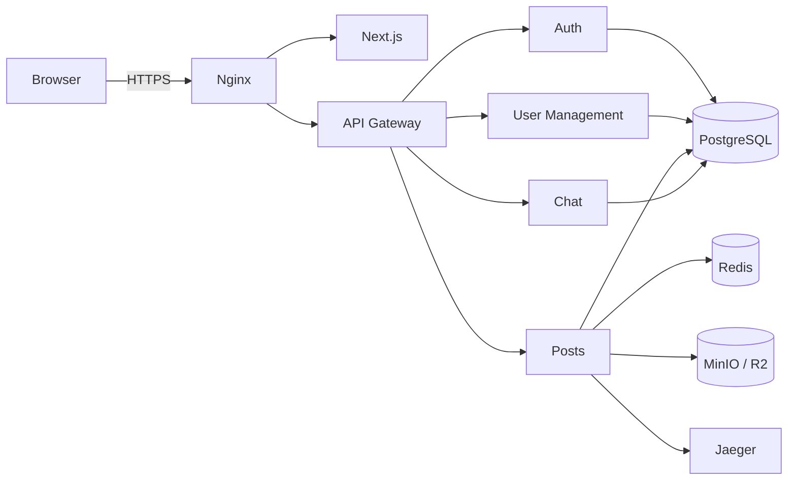
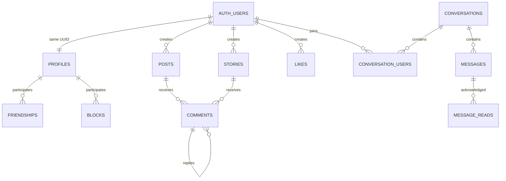

*This project has been created as part of the 42 curriculum by <PLACEHOLDER: login1>, <PLACEHOLDER: login2>, <PLACEHOLDER: login3>.* <!-- Replace with every team member's exact 42 login. -->

# Vellum

## Description

**Vellum** is a full-stack social network built for the 42 `ft_transcendence` project. It provides secure account management, social publishing, user relationships, and real-time direct and group communication.

The application follows a microservice architecture behind nginx and an API gateway. Authentication, profiles, posts, and chat are independently maintained services sharing PostgreSQL through isolated schemas.

### Key Features

- Local registration, JWT login, Google OAuth 2.0, and optional TOTP 2FA.
- Profiles, avatars, friend requests, friendships, and blocking.
- Posts, temporary stories, media, threaded comments, and likes.
- Direct and group conversations with messages, typing indicators, read receipts, presence, and last-seen status.
- HTTPS-only public access, Redis caching, S3-compatible storage, and distributed tracing.

## Team Information

| Member | Role(s) | Responsibilities |
|---|---|---|
| `<PLACEHOLDER: login1>` | `<PLACEHOLDER: role(s)>` | `<PLACEHOLDER: responsibilities>` |
| `<PLACEHOLDER: login2>` | `<PLACEHOLDER: role(s)>` | `<PLACEHOLDER: responsibilities>` |
| `<PLACEHOLDER: login3>` | `<PLACEHOLDER: role(s)>` | `<PLACEHOLDER: responsibilities>` |

<!-- Use exact 42 logins, assigned roles such as PO, PM, Tech Lead, Developer or QA, and factual responsibilities. Add/remove rows to match the first line. -->

## Project Management

### Organization

`<PLACEHOLDER: task distribution, meeting frequency, review process, integration workflow, and definition of done.>`

<!-- Explain how tasks were assigned and how work was reviewed, tested, and integrated. -->

### Tools

- `<PLACEHOLDER: GitHub Issues/Projects, Trello, Notion, or tools actually used>`
- Git and GitHub for version control and code review.

### Communication

- `<PLACEHOLDER: Discord, Slack, WhatsApp, in-person meetings, or channels actually used>`

<!-- State how daily coordination, meetings, and urgent technical discussions were handled. -->

## Technical Stack

| Area | Technologies | Rationale |
|---|---|---|
| Frontend | Next.js, React, TypeScript, next-intl | Typed component UI, routing, and internationalization. |
| Gateway | NestJS, Passport JWT, http-proxy-middleware | Central routing, JWT validation, and identity forwarding. |
| Authentication | NestJS, Passport, JWT, bcrypt, Google OAuth, TOTP | Stateless local/federated authentication with optional 2FA. |
| User management | NestJS, TypeORM | Structured profile and transactional social-graph logic. |
| Posts | Bun, Elysia, Drizzle ORM, Zod | Lightweight HTTP service with schema-derived validation. |
| Chat | Elixir, Phoenix, Channels, Presence | Fault-tolerant real-time messaging and presence. |
| Data | PostgreSQL 16, Redis 8, MinIO/R2 | Relational integrity, caching, and direct media storage. |
| Infrastructure | Docker Compose, nginx, OpenTelemetry, Jaeger | Reproducible HTTPS deployment and tracing. |

PostgreSQL was selected for ACID transactions, relational constraints, UUID support, and schema isolation between services.

### Architecture



Only nginx is host-facing. Services communicate on a private Docker network.

## Database Schema

The shared database uses the `auth`, `user_management`, `posts`, and `chat` schemas. UUID user identifiers cross service boundaries.



| Schema | Tables | Key fields and relationships |
|---|---|---|
| auth | users | UUID, username, email, password hash, OAuth identity, timestamps, username state, and 2FA fields. |
| user_management | profiles, friendships, blocks | Profile data; requester/addressee friendship state; blocker/blocked relationships. |
| posts | posts, stories, comments, likes | User-owned content; threaded replies; polymorphic likes; media metadata. |
| chat | conversations, conversation_users, messages, message_reads, user_statuses | Membership, roles, messages, read state, and last-seen state. |

<!-- Verify final field names and constraints against migrations if the schema changes. -->

## Features List

| Feature | Functionality | Contributor(s) |
|---|---|---|
| Authentication | Local accounts, password hashing, JWTs, OAuth, and 2FA. | `<PLACEHOLDER: login(s)>` |
| Profiles | Profile details, username synchronization, and avatars. | `<PLACEHOLDER: login(s)>` |
| Social graph | Friend requests, friendships, blocking, and transactional privacy rules. | `<PLACEHOLDER: login(s)>` |
| Publishing | Posts, stories, direct media uploads, comments, replies, and likes. | `<PLACEHOLDER: login(s)>` |
| Chat | Direct/group conversations, membership, history, and real-time messages. | `<PLACEHOLDER: login(s)>` |
| Real-time status | Typing, read receipts, presence, and last-seen state. | `<PLACEHOLDER: login(s)>` |
| Gateway/security | JWT validation, request routing, HTTPS, and network isolation. | `<PLACEHOLDER: login(s)>` |
| Platform services | Redis caching, object storage, tracing, and internationalized UI. | `<PLACEHOLDER: login(s)>` |

<!-- Replace contributor placeholders with exact logins. Add missing final features and remove anything not implemented. -->

## Modules

| Classification | Exact subject module | Points | Justification | Implementation | Contributor(s) |
|---|---|---:|---|---|---|
| `<PLACEHOLDER: Major/Minor>` | `<PLACEHOLDER: module name>` | `<PLACEHOLDER: 2/1>` | `<PLACEHOLDER>` | `<PLACEHOLDER>` | `<PLACEHOLDER: login(s)>` |
| `<PLACEHOLDER: Major/Minor>` | `<PLACEHOLDER: module name>` | `<PLACEHOLDER: 2/1>` | `<PLACEHOLDER>` | `<PLACEHOLDER>` | `<PLACEHOLDER: login(s)>` |

**Total: `<PLACEHOLDER: total points>` points.**

<!-- Copy exact names/classifications from your subject version. Major = 2 points; Minor = 1. Add every selected module and fully justify custom Modules of Choice. -->

## Individual Contributions

### `<PLACEHOLDER: login1>`
- **Roles:** `<PLACEHOLDER>`
- **Components/features:** `<PLACEHOLDER: detailed factual list>`
- **Challenge:** `<PLACEHOLDER: concrete challenge>`
- **Resolution:** `<PLACEHOLDER: how it was overcome>`

### `<PLACEHOLDER: login2>`
- **Roles:** `<PLACEHOLDER>`
- **Components/features:** `<PLACEHOLDER: detailed factual list>`
- **Challenge:** `<PLACEHOLDER: concrete challenge>`
- **Resolution:** `<PLACEHOLDER: how it was overcome>`

### `<PLACEHOLDER: login3>`
- **Roles:** `<PLACEHOLDER>`
- **Components/features:** `<PLACEHOLDER: detailed factual list>`
- **Challenge:** `<PLACEHOLDER: concrete challenge>`
- **Resolution:** `<PLACEHOLDER: how it was overcome>`

<!-- Add/remove sections to match the team list. Include shared work where appropriate. -->

## Instructions

### Prerequisites

- Linux or a Docker Desktop-supported platform.
- Git, GNU Make, Docker Engine, Docker Compose v2, and OpenSSL.
- A browser capable of accepting a self-signed local certificate.
- For Google login, a Google Cloud Web application OAuth client.

The Docker workflow does not require host installations of Node.js, Bun, Elixir, PostgreSQL, Redis, or MinIO.

### Installation and Execution

1. Clone and enter the repository:

   ```bash
   git clone <PLACEHOLDER: repository URL>
   cd transcendence
   ```

   <!-- Replace with the canonical submission repository URL. -->

2. Generate configuration, build, and start:

   ```bash
   make up
   ```

   Use `make up-d` for detached execution.

3. Accept the self-signed certificate warning.
4. Open `https://localhost`. The API gateway is at `https://localhost:8443`.

### Environment Configuration

`make up` runs `ops/init.sh --auto`, generating root/service `.env` files and certificates under `ops/nginx/certs/`. Never commit generated credentials.

For interactive secret configuration:

```bash
make setup
make up
```

Custom ports:

```bash
HTTPS_PORT=4443 API_HTTPS_PORT=9443 make up
```

### Google OAuth

Create a Google Cloud **Web application** OAuth client, configure OpenID/email/profile scopes, and add test users while the consent screen is in testing mode. Register this exact redirect URI:

```text
https://localhost:8443/auth/google/callback
```

Set in `backend/services/auth/.env`:

```env
GOOGLE_CLIENT_ID=<client ID>
GOOGLE_CLIENT_SECRET=<client secret>
GOOGLE_CALLBACK_URL=https://localhost:8443/auth/google/callback
GOOGLE_TEST_CALLBACK_URL=http://localhost:4001/auth/google/callback/test
FRONTEND_OAUTH_SUCCESS_URL=https://localhost/auth/callback
```

Recreate the service:

```bash
docker compose up -d --force-recreate auth-service
```

Update all URLs and Google Cloud settings when custom ports are used.

### Useful Commands

```bash
make up                  # Build and run
make up-d                # Run detached
make down                # Stop
make logs                # Follow logs
make ps                  # Service status
make build               # Build images
make restart-auth-service
make clean               # Remove containers, networks, volumes
make fclean              # Also remove images, env files, certificates
make re                  # Recreate everything
```

`make clean` and `make fclean` remove local state.

## Usage

1. Register locally or continue with Google.
2. Complete the profile and choose a unique username if required.
3. Manage friends and blocked users.
4. Publish posts/stories, comment, and like content.
5. Start direct or group conversations and exchange real-time messages.

## Testing

Run inside each relevant service directory:

```bash
# NestJS services
npm run test
npm run test:e2e
npm run test:cov

# Posts
bun test

# Chat
mix test
```

Some integration tests require shared infrastructure.

`<PLACEHOLDER: final pre-submission test, lint, formatting, and migration command sequence.>`

<!-- Record the exact commands the team actually runs before evaluation. -->

## Known Limitations

- Local TLS uses a self-signed certificate.
- Google OAuth requires external credentials and exact redirect configuration.
- `<PLACEHOLDER: other functional, browser, deployment, accessibility, or testing limitations>`

<!-- Replace or remove the placeholder and remain honest about limitations. -->

## Resources

### References

- [42 project platform](https://projects.intra.42.fr/)
- [Next.js](https://nextjs.org/docs) and [React](https://react.dev/)
- [NestJS](https://docs.nestjs.com/) and [Passport](https://www.passportjs.org/)
- [Google OAuth 2.0](https://developers.google.com/identity/protocols/oauth2/web-server)
- [JWT](https://jwt.io/introduction)
- [Phoenix](https://hexdocs.pm/phoenix/) and [Channels](https://hexdocs.pm/phoenix/channels.html)
- [Elysia](https://elysiajs.com/) and [Bun](https://bun.sh/docs)
- [PostgreSQL 16](https://www.postgresql.org/docs/16/)
- [TypeORM](https://typeorm.io/) and [Drizzle ORM](https://orm.drizzle.team/docs/overview)
- [Redis](https://redis.io/docs/latest/), [Docker](https://docs.docker.com/), and [nginx](https://nginx.org/en/docs/)
- [OpenTelemetry](https://opentelemetry.io/docs/)
- [OWASP Authentication Cheat Sheet](https://cheatsheetseries.owasp.org/cheatsheets/Authentication_Cheat_Sheet.html)
- [OWASP OAuth 2.0 Cheat Sheet](https://cheatsheetseries.owasp.org/cheatsheets/OAuth2_Cheat_Sheet.html)

### Use of Artificial Intelligence

AI-assisted tools were used for:

- `<PLACEHOLDER: code/debugging/testing tasks and affected services>`
- `<PLACEHOLDER: research or documentation tasks>`
- `<PLACEHOLDER: review and verification process>`

All suggestions were reviewed, adapted, and tested by the team. Official documentation and the subject were used to validate decisions.

<!-- Be precise and honest about tools, tasks, affected components, and human verification. -->

## Additional Documentation

- [Chat API](CHAT_API_DOCUMENTATION.md)
- [HTTP client testing](docs/http-client-testing.md)
- [Auth service](backend/services/auth/README.md)
- [Posts service](backend/services/posts/README.md)
- [User management](backend/services/user-management/README.md)
- [Operations](ops/README.md)

## License

`<PLACEHOLDER: license name or "No license has been selected.">`

<!-- Add the applicable LICENSE file or explicitly state that no license was selected. -->
